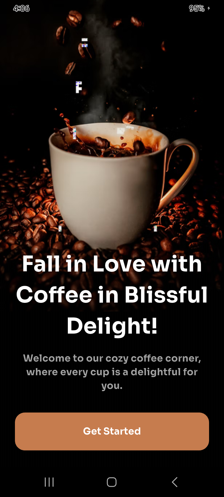
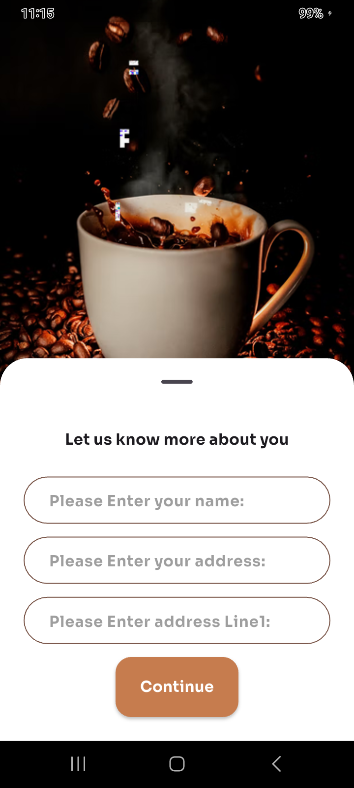
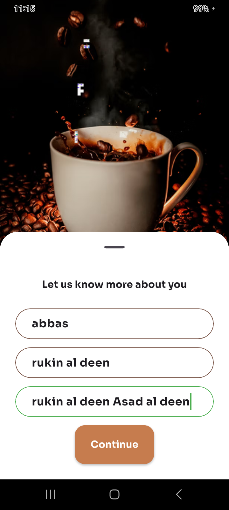
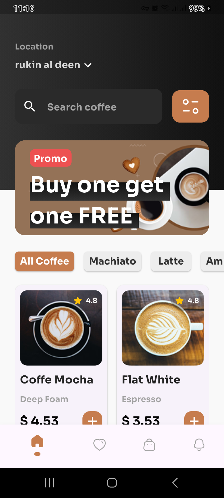
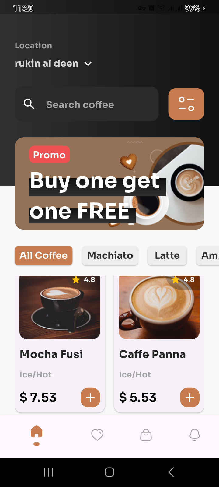
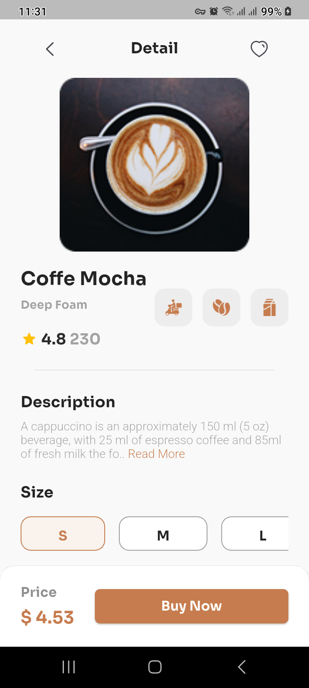
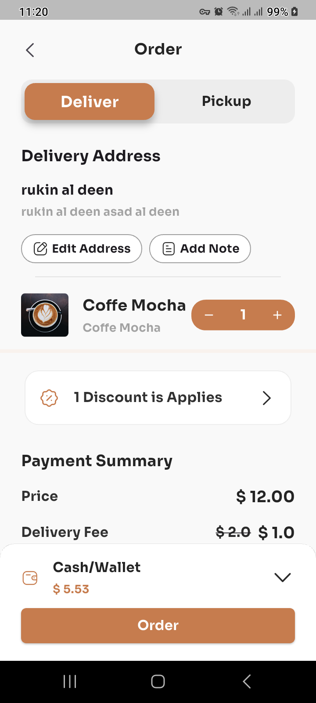
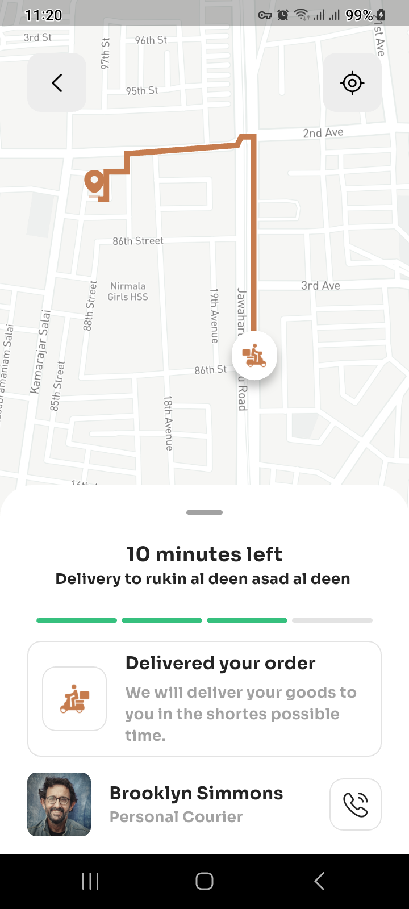

# coffee_shop

A Mobile app provides ordering coffee service.

# Featurs

1. Choose amoung multible kinds of coffee.
2. Add your choices to favorites list.
3. Orderd coffee delivered to you location.
4. Present delivery status and Delivery man location on map.

# The packages used in this project:

`flutter_bloc` - for state management. `flutter_gen` - Used to orginize files. `flutter_dotenv` - to manage enviroment variables. `flutter_screenutil` - provide utiles help in making responsive layouts. `step_progress_indicator` `flutter_native_splash` `iconly` `iconsax` `iconsax_linear` `permission_handler` `pretty_dio_logger` `theme_tailor_annotation` `build_runner` `flutter_gen_runner` `flutter_lints` `theme_tailor`

# Preview

The following previews shows how to login in to the app:

  
  

  

The following shows the home page:

  
  

The following shows a product detailes:

  

The following shows how to order coffee:

  

The following shows the delivery status and delivery man location:

  

